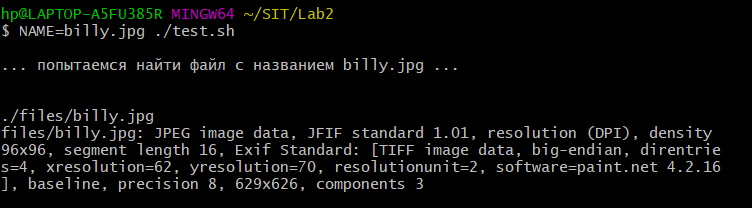
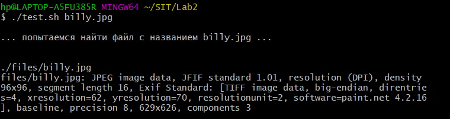
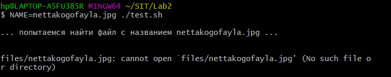
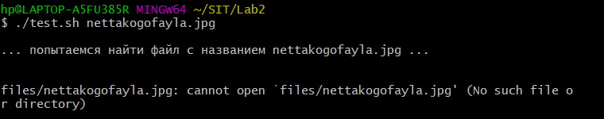
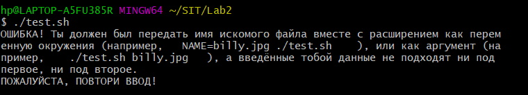

# ENV
Скрипт получает на ввод имя файла вместе с расширением одним из двух способов (как переменную окружения либо как аргумент), после чего ищет его в папке /files с помощью утилиты find и узнаёт данные о нём с помощью утилиты file.

Код скрипта test.sh и папка files лежат в репозитории.

Пример работы: 

1) Ищем файл billy.jpg, передавая название файла как переменную окружения. Успех.

2) Ищем файл billy.jpg, передавая название файла как аргумент. Тоже успех.

3) Ищем файл nettakogofayla.jpg, которого нет в папке /files, как переменную окружения. Программа пишет, что такой файл найти не удалось.

4) Ищем файл nettakogofayla.jpg, которого нет в папке /files, как аргумент. Аналогично предыдущему.

5) Вообще никак не передаём имя искомого файла. Программа выдаёт ошибку.

